# R Markdown Articles

A reusable project for authoring, building, and publishing
[R Markdown](https://rmarkdown.rstudio.com/) articles to
[Blogger](https://www.blogger.com/).

Each article lives in its own subfolder and shares a common build configuration.
A single GitHub Actions workflow builds any article on demand and publishes the
resulting HTML to Blogger.

## Pipeline Overview

The publishing pipeline is automated using GitHub Actions and consists of three
sequential jobs:

1. **Validate**: Checks that all required inputs (article name, title, and
   labels) are present.
2. **Build**: Compiles the R Markdown source into HTML using GNU R and uploads
   the result as an artifact.
3. **Publish**: Downloads the HTML artifact and publishes it to Blogger using
   the Google Blogger API.

```mermaid
graph LR
    %% Trigger
    Start(("User Trigger<br/>(workflow_dispatch)")) --> ValidateJob

    %% Job: Validate
    subgraph ValidateJob ["Job: Validate Inputs"]
        direction LR
        InputLogic{"Check Inputs:<br/>Name, Title, Labels"}

        InputLogic -- "All Empty" --> OutputSkip["Output: build=false"]
        InputLogic -- "Partial / Missing" --> ExitFail["Exit 1 (Fail)"]
        InputLogic -- "All Provided" --> OutputBuild["Output: build=true"]
    end

   %% Conditional Logic between Jobs
    OutputSkip -.-> EndSkip([End: Skipped])
    ExitFail --> EndFail([End: Failed])
   OutputBuild ==>|build=true| StepCheckout

      %% Job: Build
      subgraph BuildJob ["Job: Build"]
        direction LR

        StepCheckout[/"Step: Checkout Code<br/>(actions/checkout)"/]
        StepGNUR["Step: Build HTML<br/>(frankhjung/gnur)"]
        StepUpload[/"Step: Upload Artifact<br/>(actions/upload-artifact)"/]

        StepCheckout --> StepGNUR
        StepGNUR --> StepUpload
    end

    %% Job: Publish
    subgraph PublishJob ["Job: Publish"]
        direction LR
        StepDownload[/"Step: Download Artifact<br/>(actions/download-artifact)"/]
        StepBlogger["Step: Publish to Blogger<br/>(frankhjung/blogger)"]

        StepDownload --> StepBlogger
    end

    %% End State
    StepUpload ==> StepDownload
    StepBlogger --> EndSuccess((End: Success))

    %% Styling
    classDef green fill:#e1f5fe,stroke:#01579b,stroke-width:2px;
    classDef red fill:#ffebee,stroke:#b71c1c,stroke-width:2px;
    classDef yellow fill:#fffde7,stroke:#fbc02d,stroke-width:2px;

    class Start,EndSuccess green;
    class EndFail red;
    class EndSkip yellow;
```



## Project Structure

```text
rmarkdown/
├── Makefile                # Root delegating Makefile
├── files/
│   ├── article.mk          # Shared article Makefile
│   ├── make.R              # R rendering script
│   ├── article.Rmd         # Article template
│   ├── article.css         # HTML styling
│   └── preamble.tex        # LaTeX preamble for PDF
├── images/
│   └── banner.jpg          # Default banner image
├── docs/                   # Project documentation
├── test/                   # Test article
├── <article_name>/         # One folder per article
│   ├── Makefile             # Hard link → files/article.mk
│   ├── make.R              # Hard link → files/make.R
│   ├── article.Rmd         # Article source
│   ├── files/
│   │   ├── article.css     # Hard link → files/article.css
│   │   └── preamble.tex    # Hard link → files/preamble.tex
│   └── images/
│       └── banner.jpg      # Article banner
└── .github/workflows/
    └── publish.yml         # Build & publish workflow
```

## Prerequisites

- [R](https://www.r-project.org/) (version 4.0+)
- R packages: `rmarkdown`, `knitr`, `ggplot2`, and others (see `files/make.R`
  and article `Rmd` files for the full list)
- [GNU Make](https://www.gnu.org/software/make/)
- [pandoc](https://pandoc.org/) (bundled with RStudio or install separately)
- [Docker](https://www.docker.com/) (optional, for containerised builds)

### Installing R Packages

```r
install.packages(c(
  "broom", "dplyr", "forcats", "ggplot2", "knitr",
  "lubridate", "magrittr", "purrr", "readr", "rlang",
  "rmarkdown", "scales", "stringr", "tibble", "tidyr"
))
```

## Creating a New Article

```bash
make new-article article_name=my-article
```

This scaffolds a new article folder with all required files and links.

## Building Locally

```bash
# Build a specific article
make -B base-rate

# List available articles
make list

# Clean a specific article
make base-rate-clean

# Clean all articles
make clean
```

Build output is written to `<article_name>/public/article.html`.

## Docker Run

This project uses a pre-built GNU R image from GHCR. There is no local
`Dockerfile`; instead, pull and run the image directly.

### Run from GHCR

```bash
docker run --rm \
  -v "$PWD":/workspace \
  -w /workspace \
  ghcr.io/frankhjung/gnur:4.5.2 \
  make -B base-rate
```

### Run from DockerHub

```bash
docker run --rm \
  -v "$PWD":/workspace \
  -w /workspace \
  frankhjung/gnur:4.5.2 \
  make -B base-rate
```

## Publishing via GitHub Actions

The [publish.yml](.github/workflows/publish.yml) workflow is triggered manually
via `workflow_dispatch` with three inputs:

| Input | Description |
| :---- | :---------- |
| `article_name` | Article subfolder name (e.g. `base-rate`) |
| `article_title` | Post title as it appears on Blogger |
| `article_labels` | Comma-separated labels for the post |

The workflow validates inputs, builds the article inside a Docker container
using the [gnur](https://ghcr.io/frankhjung/gnur) image, and publishes the
resulting HTML to Blogger using the
[blogger](https://github.com/frankhjung/docker-blogger) image.

### Required Secrets

| Secret | Description |
| :----- | :---------- |
| `BLOGGER_BLOG_ID` | Destination blog identifier |
| `BLOGGER_CLIENT_ID` | Google OAuth Client ID |
| `BLOGGER_CLIENT_SECRET` | Google OAuth Client Secret |
| `BLOGGER_REFRESH_TOKEN` | Long-term API access token |

## References

- [R Markdown](https://rmarkdown.rstudio.com/)
- [Blogger API](https://developers.google.com/blogger)
- [docker-blogger](https://github.com/frankhjung/docker-blogger)

## [MIT License](LICENSE)

© Frank H Jung 2026
