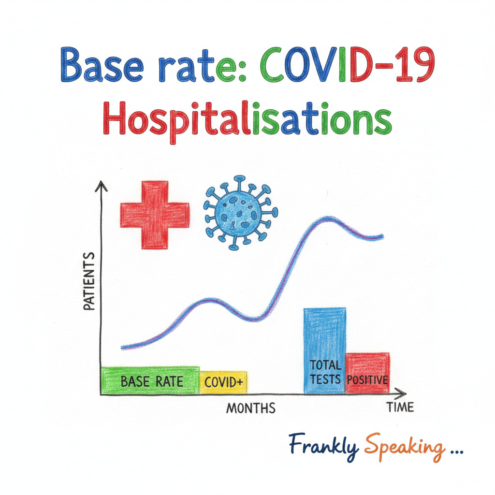
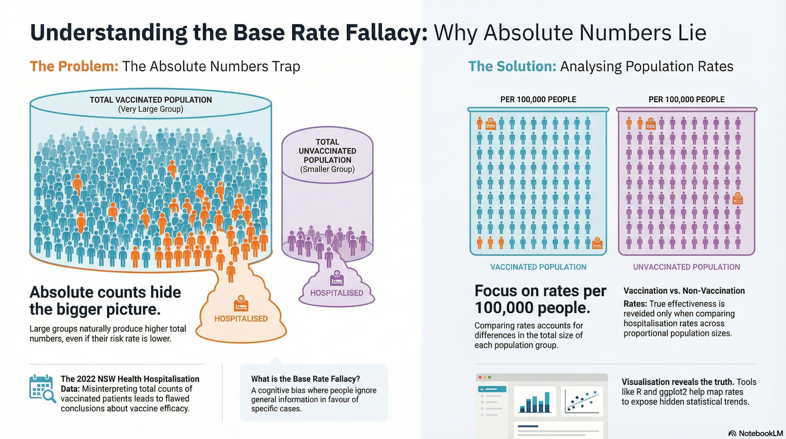

```{r setup, include=FALSE, echo=FALSE, message=FALSE, warning=FALSE}
knitr::opts_chunk$set(echo = TRUE)
require(ggplot2)
```



## COVID-19 Hospitalisations

COVID-19 hospitalisation data are openly reported but the information provided
is being misrepresented. Take, for example, the following Facebook post:


While accurate with regard to the numbers, Peter is implying that vaccination
does not work as more vaccinated people are in hospital than unvaccinated
people. This is a misrepresentation because the emphasis Peter makes is on the
_absolute number_ rather than the rate of hospitalisations among vaccinated
versus unvaccinated individuals.

For example, let's use data approximately based on the figures
available from the same source as Peter's, namely NSW Health data.

```{r nsw-hospitalisations}
# Population data (per 1,000 people for rate calculation)
total_population <- 1000
vaccination_rate <- 0.929 # 92.9% vaccination rate in NSW, Jan 2022
vaccinated_population <- vaccination_rate * total_population
unvaccinated_population <- (1 - vaccination_rate) * total_population

# Hospitalisation numbers from NSW Health data
vaccinated_hospitalised <- 2627 + 215 # ICU + ward
unvaccinated_hospitalised <- 315 + 55 # ICU + ward

# Death numbers from NSW Health data
vaccinated_deaths <- 67
unvaccinated_deaths <- 21
```

```{r unvaccinated-rate}
unvaccinated_hospitalisation_rate <- unvaccinated_hospitalised / unvaccinated_population
```

The hospitalisation rate among unvaccinated people is:
`r round(unvaccinated_hospitalisation_rate, 2)` per 1,000 people.

```{r vaccinated-rate}
vaccinated_hospitalisation_rate <- vaccinated_hospitalised / vaccinated_population
```

The hospitalisation rate among vaccinated people is:
`r round(vaccinated_hospitalisation_rate, 2)` per 1,000 people.

```{r hospitalisation-rate-ratio}
hospitalisation_rate_ratio <- unvaccinated_hospitalisation_rate / vaccinated_hospitalisation_rate
```

## Understanding the Numbers

The rates reveal a dramatically different picture than the absolute numbers:

- Unvaccinated hospitalisation rate:
  **`r round(unvaccinated_hospitalisation_rate, 2)`** per 1,000 people
- Vaccinated hospitalisation rate:
  **`r round(vaccinated_hospitalisation_rate, 2)`** per 1,000 people
- **Unvaccinated people are hospitalised at
  `r round(hospitalisation_rate_ratio, 1)`
  times the rate of vaccinated people**

```{r visualisation, echo=FALSE, fig.height=5, fig.width=8}
# Common theme for all visualisations
base_theme <- theme_minimal() +
  theme(
    legend.position = "none",
    plot.title = element_text(size = 14, face = "bold"),
    axis.text = element_text(size = 11)
  )

# Common colour palette
status_colours <- c("Vaccinated" = "#2E7D32", "Unvaccinated" = "#C62828")

# Create data frame for visualisation
hospital_data <- data.frame(
  Status = c("Vaccinated", "Unvaccinated"),
  Rate = c(vaccinated_hospitalisation_rate, unvaccinated_hospitalisation_rate),
  Population = c(vaccinated_population, unvaccinated_population),
  Hospitalised = c(vaccinated_hospitalised, unvaccinated_hospitalised)
)

# Hospitalisation rates comparison
ggplot(hospital_data, aes(x = Status, y = Rate, fill = Status)) +
  geom_col() +
  geom_text(aes(label = round(Rate, 2)), vjust = -0.5, size = 5) +
  scale_fill_manual(values = status_colours) +
  expand_limits(y = max(hospital_data$Rate) * 1.15) +
  labs(
    title = "Hospitalisation Rates per 1,000 People",
    subtitle = "Comparing vaccinated vs unvaccinated individuals",
    x = "Vaccination Status",
    y = "Rate per 1,000 People"
  ) +
  base_theme
```

## The Base Rate Fallacy



The base rate fallacy occurs when we ignore the base rate (the underlying
proportion) of a population when evaluating statistics. In this case:

- **92.9%** of the population is vaccinated
- **7.1%** of the population is unvaccinated

When such a large proportion of the population is vaccinated, we would naturally
expect more vaccinated people in absolute numbers, even if vaccination is highly
effective. The key is to compare the **rates** within each group, not the raw
counts.

```{r population-viz, echo=FALSE, fig.height=4, fig.width=8}
# Population distribution
ggplot(hospital_data, aes(x = "", y = Population, fill = Status)) +
  geom_col(width = 1) +
  coord_flip() +
  scale_fill_manual(values = status_colours) +
  geom_text(
    aes(label = paste0(round(Population / total_population * 100, 1), "%")),
    position = position_stack(vjust = 0.5),
    size = 5,
    colour = "white",
    fontface = "bold"
  ) +
  labs(
    title = "Population Distribution by Vaccination Status",
    x = "",
    y = "Population (per 1,000)"
  ) +
  theme_minimal() +
  theme(
    axis.text.y = element_blank(),
    axis.ticks.y = element_blank(),
    plot.title = element_text(size = 14, face = "bold")
  )
```

## Death Rates

The pattern is even more pronounced when we examine death rates:

```{r death-rates}
vaccinated_death_rate <- vaccinated_deaths / vaccinated_population
unvaccinated_death_rate <- unvaccinated_deaths / unvaccinated_population
death_rate_ratio <- unvaccinated_death_rate / vaccinated_death_rate
```

- Vaccinated death rate: `r round(vaccinated_death_rate, 3)` per 1,000.
- Unvaccinated death rate: `r round(unvaccinated_death_rate, 3)` per 1,000.
- Unvaccinated people are `r round(death_rate_ratio, 1)` times more likely to die from COVID-19.

```{r death-viz, echo=FALSE, fig.height=5, fig.width=8}
# Death rates comparison
death_data <- data.frame(
  Status = c("Vaccinated", "Unvaccinated"),
  Rate = c(vaccinated_death_rate, unvaccinated_death_rate)
)

ggplot(death_data, aes(x = Status, y = Rate, fill = Status)) +
  geom_col() +
  geom_text(aes(label = round(Rate, 3)), vjust = -0.5, size = 5) +
  scale_fill_manual(values = status_colours) +
  expand_limits(y = max(death_data$Rate) * 1.15) +
  labs(
    title = "Death Rates per 1,000 People",
    subtitle = "Comparing vaccinated vs unvaccinated individuals",
    x = "Vaccination Status",
    y = "Rate per 1,000 People"
  ) +
  base_theme
```

## Conclusion

The data clearly demonstrates that vaccination significantly reduces the risk of
both hospitalisation and death from COVID-19. Unvaccinated individuals are
hospitalised at approximately
**`r round(hospitalisation_rate_ratio, 1)` times the rate**
of vaccinated individuals, and die at approximately
**`r round(death_rate_ratio, 1)` times the rate**.

When evaluating public health statistics, it's essential to:

1. Consider **rates** rather than absolute numbers
2. Account for the **base rate** (population proportions)
3. Understand that with high vaccination coverage, vaccinated individuals may
   still represent larger absolute numbers in hospitals while having much lower risk

Focusing solely on absolute numbers, as in the Facebook post cited, leads to the
base rate fallacy and fundamentally misrepresents the protective effect of
vaccination.

## References

* [The Guardian: The simple numbers every government should use to fight anti-vaccine misinformation](https://www.theguardian.com/news/datablog/ng-interactive/2022/jan/28/the-simple-numbers-every-government-should-use-to-fight-anti-vaccine-misinformation)
* [OurWorldInData: How do death rates from COVID-19 differ between people who are vaccinated and those who are not?](https://ourworldindata.org/covid-deaths-by-vaccination)
* [COVID-19 WEEKLY SURVEILLANCE IN NSW, EPIDEMIOLOGICAL WEEK 01 ENDING 8 JANUARY 2022, Published 20 January 2022](https://www.health.nsw.gov.au/Infectious/covid-19/Documents/covid-19-surveillance-report-20220120.pdf) -
  In this report, table 5 shows Hospitalisations, ICU admissions and deaths
  among cases diagnosed with COVID-19, by vaccination status, NSW, from 26
  November 2021 to 8 January 2022.
* [NSW Vaccination Status](https://www.health.gov.au/sites/default/files/documents/2022/01/covid-19-vaccine-rollout-update-23-january-2022.pdf)
